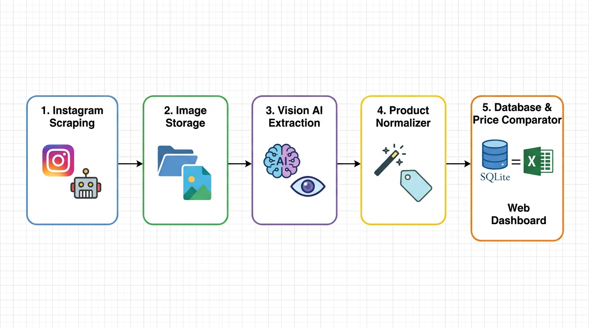

# 🛒 FlyerScout AI • Instagram Supermarket Flyers Scraper & Price Comparator

> **End-to-end automated pipeline for scraping supermarket promotional flyers on Instagram, extracting prices with Vision AI, normalizing canonical product names, and comparing prices across competing stores.**

---

## 📐 System Architecture



---

## ✨ Overview & Key Features

**FlyerScout AI** automates the entire supermarket flyer auditing workflow. Built with an asynchronous FastAPI backend and a responsive modern Web Dashboard (Glassmorphism UI), it executes background tasks with real-time SSE streaming logs.

- **📥 Decoupled 3-Stage Pipeline:**
  - **1. Scrape Flyers (`scrape_only`):** Fetches recent Instagram posts from configured supermarket accounts and saves images & metadata to local disk cache (`data/scraped_images.json`).
  - **2. Extract with Vision AI (`vision_only`):** Runs Multimodal LLMs exclusively on saved images without consuming scraping credits or re-fetching posts.
  - **3. Full Pipeline (`full`):** Runs end-to-end extraction and automated export with one click.
- **🧠 Multimodal Vision AI Engine:**
  - **Google Gemini Flash (`gemini-flash-lite-latest`, `gemini-3.5-flash-lite`):** High speed, superior OCR precision, and automatic model fallback on demand spikes.
  - **OpenAI GPT-4o / GPT-4o-mini:** Full support for OpenAI vision models.
- **🪄 Canonical Product Name Normalizer (`core/normalizer.py`):**
  - Cleans promotional noise (*"super sale"*, *"limited offer"*, *"buy 3 pay 2"*, *"today only"*).
  - Normalizes unit measurements (*"350 ml"* ➔ `350ml`, *"1 kg"* ➔ `1kg`, *"1,5L"* ➔ `1.5L`).
  - Recognizes and standardizes 70+ Brazilian supermarket brands (*Heineken, Omo, Tio João, Piracanjuba, Amstel, Coca-Cola, Qualy, etc.*).
  - Unifies product descriptions into canonical names (`[Base Product] [Brand] [Package Size]`) to enable cross-store price matching.
- **💾 Historical SQLite Database (`core/db.py`):**
  - Stores batches (`runs`) and individual deals (`offers`) in `data/flyers_database.db`.
  - Indexed for instant price comparisons and historical price tracking.
- **📊 Cross-Market Price Comparator Dashboard:**
  - Identifies the **Lowest Price** and **Cheapest Supermarket** for each product.
  - Calculates potential savings percentage (**%**) and amount (**R$**).
  - Displays side-by-side supermarket price chips with visual flyer previews.
- **🖼️ Visual Flyer Gallery:**
  - Responsive thumbnail gallery with image zoom preview and original Instagram post links.
  - Individual **"🔬 Test with AI"** modal for real-time single-image verification.
- **📈 Advanced Excel & CSV Exports:**
  - Formatted `.xlsx` workbooks including a **Price Comparison Matrix** with soft green highlights on the lowest prices.

---

## 📁 Project Structure

```
Weekly-Flyers-Scraper/
├── app.py                     # FastAPI web server with REST endpoints & SSE streaming
├── run.bat                    # 1-click Windows startup executable
├── requirements.txt           # Python dependencies
├── architecture_flowchart.png # Visual draw.io style architecture diagram
├── .env.example               # Environment variables template
├── .gitignore                 # Secret and runtime file protection
├── README.md                  # Project documentation (English)
├── core/
│   ├── config.py              # Secure credential management and profile persistence
│   ├── scraper.py             # Apify Instagram scraper integration & date filters
│   ├── vision_ai.py           # Multimodal vision extraction (Gemini / OpenAI) with fallback
│   ├── normalizer.py          # Semantic product canonicalization & brand normalization
│   ├── categorizer.py         # Heuristic retail category fallback classifier
│   ├── db.py                  # SQLite database management & comparison queries
│   ├── exporter.py            # Formatted Excel (.xlsx) comparison matrix & CSV exporter
│   └── task_runner.py         # Background task worker and SSE log dispatcher
├── data/                      # Local storage (gitignored: database, cache, config)
├── output/                    # Generated Excel & CSV reports
├── static/
│   ├── css/style.css          # Modern glassmorphism UI & responsive styles
│   └── js/app.js              # Frontend logic, real-time SSE listener & comparator UI
└── templates/
    └── index.html             # Main dashboard template
```

---

## 🚀 Quick Start

### 1. Prerequisites
- **Python 3.10+**
- An [Apify](https://console.apify.com/) account for your `APIFY_TOKEN`.
- A [Google AI Studio API Key](https://aistudio.google.com/app/apikey) for Gemini (Free tier available) or [OpenAI API Key](https://platform.openai.com/).

### 2. Installation & Running

```bash
# 1. Clone repository
git clone https://github.com/AVerz26/Weekly-Flyers-Scraper.git
cd Weekly-Flyers-Scraper

# 2. Install dependencies
pip install -r requirements.txt

# 3. Start the application
python app.py
# Or on Windows, double-click run.bat
```

Open your browser and navigate to: **`http://localhost:8000`**

---

## ⚙️ Initial Configuration

1. In the Web Dashboard, click **"⚙️ Configurações"** in the top navigation bar.
2. Enter your **Apify Token** (`apify_api_...`) and **Google Gemini API Key** (`AIzaSy...`).
3. Click **Save Settings**.
4. In the **Profiles** modal, manage your monitored Instagram supermarket accounts.
5. Use the top action buttons:
   - **`1. Coletar Encartes`**: Scrapes and downloads flyer images to disk cache.
   - **`2. Extrair c/ IA`**: Extracts deals and normalizes products from cached flyers without re-scraping.
   - **`⚡ Pipeline Completo`**: Runs the complete automated pipeline from start to finish.

---

---

## 🤖 GitHub Actions • Daily Automation

The repository includes a fully automated GitHub Actions workflow (`.github/workflows/daily_scraper.yml`) that runs daily to scrape supermarket flyers, extract deals with Vision AI, update the SQLite database, and sync the latest results with **GitHub Pages**.

### ⏰ Schedule & Triggers
- **Daily Cron:** Runs every day at **10:00 UTC** (07:00 AM Brasília Time).
- **Manual Trigger (`workflow_dispatch`):** Run the scraper anytime on demand directly from the GitHub web UI.

### 🔑 Repository Secrets Setup
To enable the workflow in your GitHub repository:
1. Navigate to your repository: `https://github.com/AVerz26/Weekly-Flyers-Scraper`
2. Go to **Settings** ➔ **Secrets and variables** ➔ **Actions**.
3. Under **Repository secrets**, click **New repository secret** and add:
   - `APIFY_TOKEN`: Your Apify API token (`apify_api_...`)
   - `GEMINI_API_KEY`: Your Google AI Studio Gemini API Key (`AIzaSy...`)
   - *(Optional)* `OPENAI_API_KEY`: If you prefer OpenAI models.
4. Go to **Settings** ➔ **Actions** ➔ **General** ➔ **Workflow permissions**, and ensure **"Read and write permissions"** is selected so the action can commit updated results to `docs/data/` and `data/`.

### 💻 Headless CLI Execution
You can also run the scraper locally or on any server without the web UI:

```bash
# Run full pipeline with default settings
python run_scraper.py

# Custom mode and date filter
python run_scraper.py --mode full --date-mode yesterday_today --limit 3 --provider gemini --model gemini-flash-lite-latest
```

---

## 🛡️ License & Author

Developed by **André Verzoto** ([@AVerz26](https://github.com/AVerz26)).  
Released under the **MIT License**.
